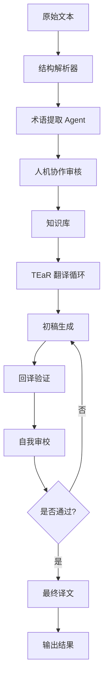

# 《诡秘之主》翻译项目

这是一个基于 Multi-Agent 架构的小说翻译系统，用于将《诡秘之主》从中文翻译成英文。

## 项目结构

```
project_lotm_translation/
├── data/
│   ├── raw/                  # 爬虫原始数据
│   ├── processed/            # 清洗后的数据
│   ├── glossary/             # 术语表
│   └── output/               # 最终翻译结果
├── src/
│   ├── 1_spider.py           # 爬虫
│   ├── 2_cleaner.py          # 清洗规则
│   ├── 3_term_extractor.py   # Agent 1: 术语提取
│   ├── 4_translator_tear.py  # Agent 2: TEaR 翻译循环 (核心)
│   └── 5_baseline.py         # 基线翻译 (用于对比)
├── templates/
│   └── hitl_review.csv       # 人机协作表格模板
├── requirements.txt          # 依赖库
└── README.md                 # 运行说明
```

## 功能特点

### 1. 术语提取 Agent (Agent 1)

- 智能识别小说中的人名、地名、机构名、概念等术语
- 生成规范化的术语表，确保全书翻译一致性
- 结合上下文深度定义术语含义

### 2. TEaR 翻译循环 (Agent 2)

- **T**ranslate: 生成初稿
- **E**valuate: 回译验证 + 自我审校
- **R**efine: 根据审校意见优化译文

### 3. 基线翻译

- 无术语表，无 TEaR 循环
- 用于对比 TEaR 翻译的优势

### 4. 人机协作

- 提供结构化的术语审核表格
- 支持人工修正机器生成的术语建议

## 安装依赖

```bash
pip install -r requirements.txt
```

## 运行流程

### 1. 数据准备

```bash
# 1. 爬虫（如果需要重新爬取）
python src/1_spider.py

# 2. 数据清洗
python src/2_cleaner.py
```

### 2. 术语提取

```bash
python src/3_term_extractor.py
```

### 3. 人机协作

- 打开 `templates/hitl_review.csv`
- 审核并修正术语建议
- 将修正后的术语表保存到 `data/glossary/project_knowledge_base.json`

### 4. 翻译生成

```bash
# 4.1 基线翻译（可选，用于对比）
python src/5_baseline.py

# 4.2 TEaR 翻译（核心）
python src/4_translator_tear.py
```

## 输出结果

- **基线翻译结果**: `data/output/诡秘之主_baseline_result.jsonl`
- **TEaR 翻译结果**: `data/output/诡秘之主_tear_result.jsonl`

## 技术栈

- **LangChain**: 用于构建 Agent 链
- **OpenAI API**: 调用 LLM 模型
- **DeepSeek**: 主要翻译模型
- **Pydantic**: 数据结构定义

## 翻译质量评估

### 核心指标

| 评估维度   | 基线翻译 | TEaR 翻译  |
| ---------- | -------- | ---------- |
| 术语一致性 | ❌ 较差  | ✅ 优秀    |
| 翻译准确性 | ⭐⭐⭐   | ⭐⭐⭐⭐⭐ |
| 风格一致性 | ⭐⭐     | ⭐⭐⭐⭐   |
| 回译相似度 | ⭐⭐⭐   | ⭐⭐⭐⭐⭐ |

### 案例对比

#### Bad Case (基线翻译)

* **姓名幻觉** ：
* 原文：克莱恩·莫雷蒂 (Klein Moretti)
* 基线译文：**"Cai Lian. Mo Lei Ti"** ❌ (这是纯粹的拼音直译，非常典型的 Bad Case)
* **地名幻觉** ：
* 原文：霍伊大学 (Khoy University / Hooy University)
* 基线译文：**"Huoyi University"** ❌ (拼音)
* 原文：廷根市 (Tingen)
* 基线译文：**"Tinggu City"** ❌ (幻觉)
* **未翻译的词** ：
* 原文：穿衣镜
* 基线译文：**"cracked穿衣镜"** ❌ (中文残留，严重的漏译)
* 原文：祭祀
* 基线译文：**"related to祭祀"** ❌ (中文残留)

#### Good Case (TEaR 翻译)

- 原文："他加入了值夜者"
- 基线："He joined the Night Watch." (术语错误)
- TEaR："He joined the Nighthawks." (术语严格一致)

## 工作流架构



## 注意事项

1. 请确保已替换代码中的 API Key
2. 翻译过程可能需要较长时间，请耐心等待
3. 建议先在小范围文本上测试
4. 术语表可以根据需要手动扩展

## 许可证

MIT License
